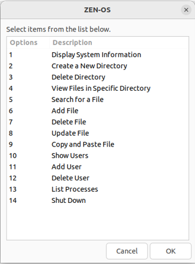

# Zen-OS

Welcome to Zen-OS, a simple and intuitive GUI-based shell script that works like an operating system created using Zenity. Zen-OS provides a user-friendly interface for performing various tasks and managing your system effortlessly.



## Features

- Display system information
- Create a new directory
- Delete a directory
- View files in the current directory
- Search for a file
- Add a file
- Delete a file
- Update a file
- Show users
- Add a user
- Delete a user
- View running processes
- Shutdown Zen-OS gracefully

## Requirements

- Linux-based operating system
- Zenity package installed

## Installation

To use Zen-OS, you need to have Zenity installed on your Linux system. If you don't have Zenity installed, follow the instructions below to install it:

### Ubuntu/Debian

```bash
sudo apt update
sudo apt install zenity
```

### Fedora

```bash
sudo dnf install zenity
```

### Arch Linux

```bash
sudo pacman -Sy zenity
```

### CentOS/RHEL

```bash
sudo yum install zenity
```

## Usage

To clone the Zen-OS repository from GitHub, follow these steps:

1. Open the terminal on your Linux system.
2. Change to the directory where you want to clone the repository.
3. Run the following command to clone the repository:
   ```bash
   git clone https://github.com/MShazim/Zen-OS.git
   ```
   
4. Once the cloning process is complete, navigate to the cloned directory:
   ```bash
   cd Zen-OS
   ```

5. Make the script executable using the following command:
   ```bash
   chmod +x Zen-OS.sh
   ```
6. Run the script using the following command:
   ```bash
   ./Zen-OS.sh
   ```
7. The Zen-OS main menu will be displayed.
8. Select the desired option from the menu to perform the corresponding task.
9. Follow the on-screen instructions and prompts to interact with Zen-OS.
10. Enjoy the simplicity and ease of use offered by Zen-OS!

## Contributions

Contributions to Zen-OS are welcome! If you find any issues or have suggestions for improvements, please feel free to submit a pull request or open an issue on the GitHub repository.

## License

This project is licensed under the [MIT License](LICENSE).

## Disclaimer

Zen-OS is a semester project created for educational purposes and may not be suitable for production environments. Use it at your own risk.

## Support

For any questions or support regarding Zen-OS, please contact me [aslamshazim20@gmail.com](mailto:aslamshazim20@gmail.com).

Happy Zen-OS-ing!